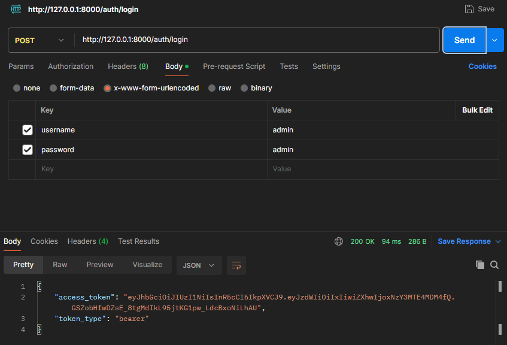
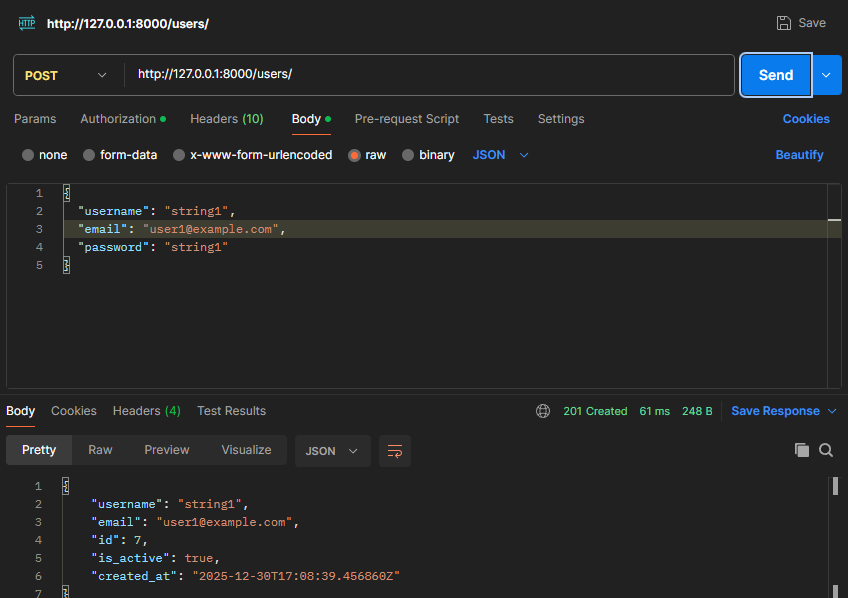
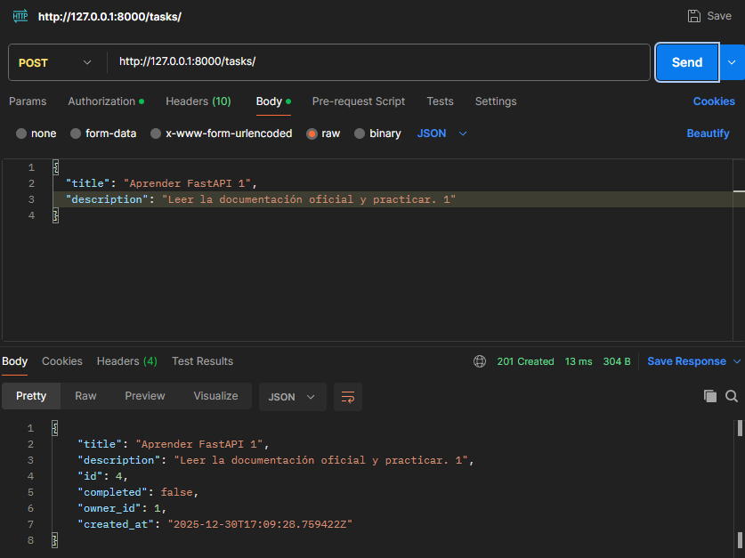

# Task Manager API

Este proyecto es una API RESTful construida con **FastAPI** para la gestión de usuarios y tareas. Incluye autenticación mediante JWT y persistencia de datos en PostgreSQL.

## 🚀 Tecnologías

*   **Python 3.10+**
*   **FastAPI**: Framework web moderno y rápido.
*   **PostgreSQL**: Base de datos relacional.
*   **Docker & Docker Compose**: Para contenerización de la base de datos.
*   **SQLAlchemy**: ORM para interacción con la base de datos.
*   **Alembic**: Sistema de migraciones de base de datos.
*   **Argon2**: Hashing seguro de contraseñas.
*   **Pydantic**: Validación de datos.
*   **PyJWT**: Generación y validación de tokens JWT.

---

## 🔑 Variables de Entorno

El proyecto incluye un archivo `.env` en el repositorio para facilitar la configuración local (solo para propósitos de esta prueba técnica).

Las variables configuradas son:

```ini
# Configuración de Base de Datos
# NOTA: Si usas el docker-compose provisto, el puerto expuesto es 5433
DB_HOST=localhost
DB_PORT=5433
DB_NAME=task_db
DB_USER=postgres
DB_PASSWORD=password

# Seguridad
SECRET_KEY=tu_clave_secreta_super_segura
ACCESS_TOKEN_EXPIRE_MINUTES=30
```

---

## 🛠️ Instrucciones de Ejecución

### 1. Prerrequisitos

 Asegúrate de tener instalado:
*   [Python](https://www.python.org/)
*   [Docker Desktop](https://www.docker.com/products/docker-desktop/)

### 2. Configuración del Entorno

1.  Clona el repositorio.
2.  Crea un entorno virtual e instala las dependencias:

```bash
python -m venv .venv
# Windows
.venv\Scripts\activate
# Linux/Mac
source .venv/bin/activate

pip install -r requirements.txt
```

### 3. Levantar Base de Datos (PostgreSQL con Docker)

El proyecto incluye un archivo `docker-compose.yml` para levantar PostgreSQL fácilmente.

```bash
docker-compose up -d
```
Esto iniciará un contenedor de PostgreSQL mapeado al puerto **5433** de tu máquina local (para evitar conflictos con instalaciones locales en el 5432).

### 4. Aplicar Migraciones

Para crear las tablas y poblar la base de datos:

```bash
alembic upgrade head
```

> **Nota:** Al ejecutar las migraciones, se crea automáticamente un usuario administrador:
> *   **Username:** `admin`
> *   **Contraseña:** `admin`

### 5. Ejecutar la Aplicación

```bash
uvicorn app.main:app --reload
```
La API estará disponible en `http://localhost:8000`.
La documentación interactiva se encuentra en `http://localhost:8000/docs`.

---

## 📡 Pruebas con Postman

Se recomienda utilizar **Postman** para probar la API. A continuación se detallan los endpoints principales y sus cuerpos de petición.


### 1. Iniciar Sesión (Login)

**Endpoint:** `POST /auth/login`
**Body (x-www-form-urlencoded):**
*   `username`: "admin"
*   `password`: "admin"



_Deberás copiar el `access_token` de la respuesta para usarlo en las siguientes peticiones (Auth Type: Bearer Token)._

### 2. Crear un Nuevo Usuario

**Endpoint:** `POST /users/`
**Auth:** Bearer Token (token de admin)
**Body (JSON):**
```json
{
  "username": "string",
  "email": "user@example.com",
  "password": "string"
}
```



### 3. Crear una Tarea

**Endpoint:** `POST /tasks/`
**Auth:** Bearer Token (token del usuario)
**Body (JSON):**
```json
{
  "title": "Aprender FastAPI",
  "description": "Leer la documentación oficial y practicar."
}
```
*Nota: El campo `completed` se inicializa automáticamente en `false`.*



### 4. Listar Tareas

**Endpoint:** `GET /tasks/`
**Auth:** Bearer Token


